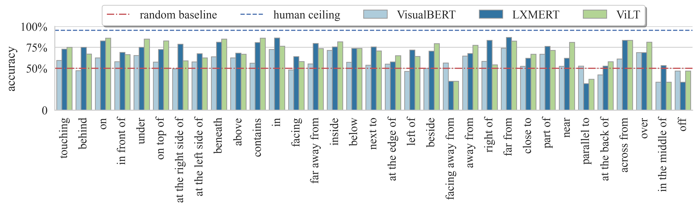
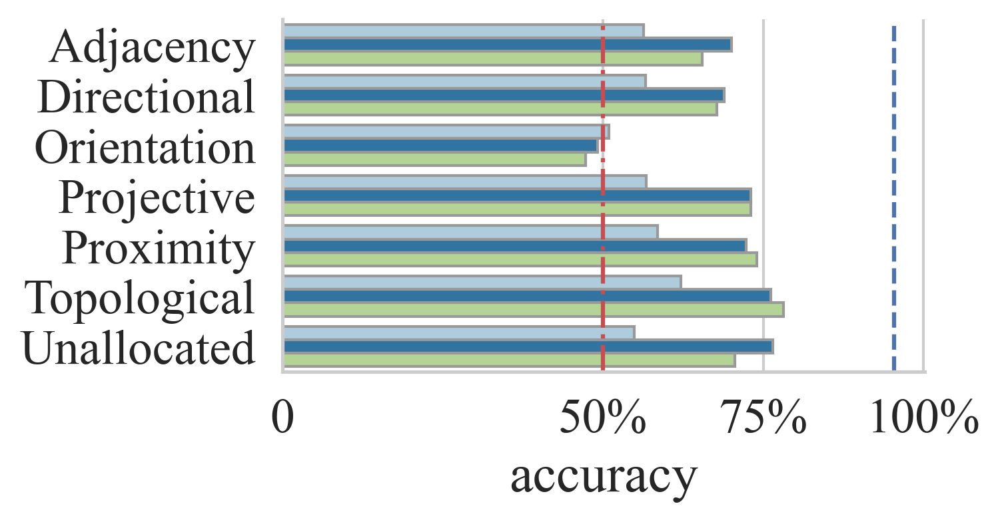

<br />
<p align="center">
  <h1 align="center">VSR: Visual Spatial Reasoning</h1>
  <h3 align="center">A probing benchmark for spatial undersranding of vision-language models.</h3>
  
  <p align="center">  
    <a href="">arxiv</a>
    ·
    <a href="https://github.com/cambridgeltl/visual-spatial-reasoning/tree/master/data">dataset</a>
  </p>
</p>

### 1 Overview

The Visual Spatial Reasoning (VSR) corpus is a collection of caption-image pairs with true/false labels. Each caption describes the spatial relation of two individual objects in the image, and a vision-language model (VLM) needs to juedge whether the caption is correctly describing the image (True) or not (False). Below are a few examples.

_The cat is behind the laptop_.  (True)   |  _The cow is ahead of the person._ (False) | _The cake is at the edge of the dining table._ (True) | _The horse is left of the person._ (False)
:-------------------------:|:-------------------------:|:-------------------------:|:-------------------------:
  |   |    |  

#### 1.1 Why VSR?
Understanding spatial relations is fundamental to achieve intelligence. Existing vision-language reasoning datasets are great but they compose multiple types of challenges and can thus conflate different sources of error.
The VSR corpus focuses specifically on spatial relations so we can have accurate diagnosis and maximum interpretability.

#### 1.2 What have we found?
Below are baselines' by-relation performances on VSR (random split). 

**_More data != better performance._** The relations are sorted by frequencies from left to right. The VLMs' by-relation performances have little correlation with relation frequency, meaning that more training data do not necessarily lead to better performance.

 

**_Understanding object orientation is hard._** After classifying spatial relations with meta-categories, we can clearly see that all models are at chance level for "orientation"-related relations (such as "facing", "facing away from", "parallel to", etc.).

For more findings and takeways including zero-shot split performance. check out our paper!

### 2 The VSR dataset: Splits, statistics, and meta-data

The VSR corpus, after validation, containing 10,119 data points with high agreement. On top of these, we create two splits (1) random split and (2) zero-shot split. For random split, we randomly splits all data points into train, development, and test sets. Zero-shot split makes sure that train, development and test sets have no overlap of concepts (i.e., if *dog* is in test set, it is not used for training and development). Below are some basic statistics of the two splits.

split   |  train | dev | test | total
:------|:--------:|:--------:|:--------:|:--------:
random | 7,083 | 1,012 | 2,024 | 10,119 
zero-shot | 5,440 | 259 | 731 | 6,430

Check out [`data/`](https://github.com/cambridgeltl/visual-spatial-reasoning/tree/master/data) for more details.

### 3 Baselines: Performance

We test three baselines, all supported in huggingface. They are VisualBERT [(Li et al. 2019)](https://arxiv.org/abs/1908.03557), LXMERT [(Tan and Bansal, 2019)](https://arxiv.org/abs/1908.07490) and ViLT [(Kim et al. 2021)](https://arxiv.org/abs/2102.03334).

model   |  random split | zero-shot
:-------------|:-------------:|:-------------:
*human* | *95.4* | *95.4* 
VisualBERT | 57.4 | 54.0
LXMERT | **72.5** | **63.2**
ViLT | 71.0 | 62.4


### 4 Baselines: How to run?

#### Download images
See `data/` folder's readme.

#### Environment
Depending on your system configuration and CUDA version, you might need two sets of environment: one environment for feature extraction and one environment for all other experiments. You can install feature extraction environment by running [`feature_extraction/feature_extraction_environment.sh`](https://github.com/cambridgeltl/visual-spatial-reasoning/blob/master/feature_extraction/feature_extraction_environment.sh) (specifically, feature extraction requires detectron2==0.5, CUDA==11.1 and torch==1.8). The default configuration for running other things can be found in [`requirements.txt`](https://github.com/cambridgeltl/visual-spatial-reasoning/blob/master/requirements.txt).

#### Extract visual embeddings
For VisualBERT and LXMERT, we need to first extract visual embeddings using pre-trained object detectors. This can be done through
```bash
bash feature_extraction/lxmert/extract.sh
```

VisualBERT feature extraction is done similarly by replacing `lxmert` with `visualbert`. The features will be stored under [`data/features/`](https://github.com/cambridgeltl/visual-spatial-reasoning/tree/master/data/features) and automatically loaded when running training and evaluation scripts of LXMERT and VisualBERT. The feature extraction codes are modified from huggingface examples [here](https://colab.research.google.com/drive/1bLGxKdldwqnMVA5x4neY7-l_8fKGWQYI?usp=sharing) (for VisualBERT) and [here](https://colab.research.google.com/drive/18TyuMfZYlgQ_nXo-tr8LCnzUaoX0KS-h?usp=sharing) (for LXMERT).

#### Train
[`scripts/`](https://github.com/cambridgeltl/visual-spatial-reasoning/tree/master/scripts) contain some example bash scripts for training and evaluations. For example, the following script trains LXMERT on the random split:
```bash
bash scripts/lxmert_train.sh 0
```
where `0` denotes device index. Checkpoint saving address can be modified in the script.

#### Evaluation
Similarly, evaluating the obtained LXMERT model can be done by running:
```bash
bash scripts/lxmert_eval.sh 0
```
The checkpoint address can be modified in the script.

In [`analysis_scripts/`](https://github.com/cambridgeltl/visual-spatial-reasoning/tree/master/analysis_scripts) you can checkout how to print out by-relation and by-meta-category accuracies.

### License
This project is licensed under the [Apache-2.0 License](https://github.com/cambridgeltl/visual-spatial-reasoning/blob/master/LICENSE).
